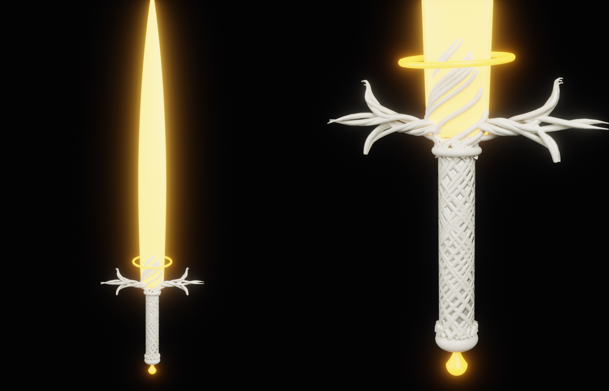

# 米凱拉光劍：雙劍素材包（魔物獵人 Wilds）

在沒有遊戲檔案的情況下，先把能做的都做好了。**這還不是可以直接安裝的 mod**，要等選好「替換哪一把原版雙劍」才能完成。



## 已經完成的

| 檔案 | 內容 | 驗證 |
|---|---|---|
| `natives/.../wp_miquella_db.mesh.241111606` | 低面數雙劍（一把），12,624 三角面，4 個子模型，都有 UV | 重新匯入正常 |
| `natives/.../wp_miquella_db.mdf2.45` | 4 個材質；~~用 RE Mesh Editor 的 Wilds 預設建立~~ → 已改成從原版雙劍的材質複製（見下方「實測後的修正」） | 參數排列跟原版一樣（180 個） |
| `natives/.../tex/*.tex.241106027` | 10 張 Wilds 格式貼圖（BC7，含完整 mipmap） | 轉回 DDS 正常 |
| `texture_sources/*.png` | 貼圖原始檔，要改顏色從這裡改 | — |
| `dual_blade_kit.blend` | Blender 4.5 工作檔 | — |

材質：

| 材質 | 預設 | 貼圖 | 說明 |
|---|---|---|---|
| MiquellaBlade | Weapon Emissive | ALBD、NRRO、EMI | 光刃，`Emissive_Color` = 亮金 `#FFA526`，強度 1.2 |
| MiquellaGlow | Weapon Emissive | ALBD、NRRO、EMI | 懸浮光環、柄尾水滴，同樣亮金發光 |
| MiquellaIvory | Weapon | ALBD、NRRO | 護手的細股、柄頭 |
| MiquellaGrip | Weapon | ALBD、NRRO（烘焙編織紋） | 刀柄：32 面的圓柱，編織細節全在法線貼圖裡 |

貼圖排列（RE 引擎格式）：
- ALBD：RGB = 顏色，A = Dielectric（白 = 非金屬）
- NRRO：R = 粗糙度、G = 法線 Y（DirectX，已從 Blender 的 OpenGL 翻轉）、B = AO、A = 法線 X
- EMI：發光遮罩（白 = 發光）

## 還要在遊戲裡完成的

1. **選一把要被替換的原版雙劍**，用 RE Asset Library 找到它的 `.mesh` 路徑
2. **匯入原版的 `.mesh`**，把我們的模型對齊原版的位置和方向，綁到原版用的骨頭上（武器通常只有一兩根）
   - 雙劍是**分開兩個檔案**（MDF-XL 資料庫確認）：`it02xx_xxxx_0.mesh` = 左手、`_1.mesh` = 右手 → 我們這一把要匯出兩份（右手那份可以鏡像）
   - 用偵察腳本 `../MiquellaLight_Scout/` 可以直接看到原版的路徑、材質名稱和骨頭名稱
3. **改名和搬路徑**：`.mesh` 和 `.mdf2` 改成原版的檔名，放到原版的路徑（`natives/STM/...`）
   - 貼圖路徑可以留在 `Art/Model/MiquellaLight/...`（MDF 裡已經設好，可以放在 natives 底下任何地方）
4. **材質名稱**：如果原版 `.mdf2` 的材質名稱有被其他檔案引用，可能要改成原版的名稱（實測確認）
5. **打包成 patch pak**：Wilds 的貼圖不能用散檔，要用 RE Mesh Editor 的「Create Pak Patch」打包，放進遊戲的 `pak_mods`（需要 REFramework）
6. **搭配收刀隱藏腳本**：`../MiquellaLight_HideSheathed/`，把這把雙劍加進清單
7. **用 MDF-XL 在遊戲裡微調**發光顏色和強度（Filmic 算圖只是預覽，遊戲的色調處理不一樣）

## 另一條路：不覆蓋原版檔案

MDF-XL 的武器換裝是在遊戲執行中把武器的模型換掉（`setMesh` / `set_Material`），不用覆蓋原版檔案，也能只在拿某一把武器時才換。

**已經寫好了**：`../MiquellaLight_Weapons/`（含收刀隱藏）。用這條路的話，上面第 1、3 步（選一把犧牲、改名搬路徑）都不用做：模型和貼圖就放在現在的 `Art/Model/MiquellaLight/...` 路徑，打包成 patch pak 就好。

## 第一次遊戲實測後的修正（2026-10-01，`fit_dual_blades.py`）

使用者實測：光劍有出現，但①浮在手背上、沒握在手裡，②不發光、黑的。原因和修法：

| 問題 | 原因 | 修法 |
|---|---|---|
| 位置不對 | 原版武器（例：`it0200_0024_0`）刀身朝檔案的 **+Z**、**手握的位置在原點**（刀柄約 -0.04～+0.13，柄頭到 -0.10），骨架 `root`／`Base`／`VFX_Attack`，全部頂點綁 `Base`。我們的刀身朝 +Y、原點在柄頭、沒有骨架 | 刀身轉 90° 朝 +Z、整把往下移 0.05（刀柄 -0.04～+0.10），骨架直接從原版匯入，全部綁 `Base` |
| 不發光 | RE Mesh Editor 0.66 的 Wilds「Weapon Emissive」預設是**舊版遊戲**的：176 個參數；現在的遊戲有 180 個（多了 `AnimEmit_Blend`、`Use_Basecolor_Mask`、`Basecolor_Mask_Min/Max`）。遊戲照位置讀參數，後面的值全部讀錯 | 每個材質改成**複製原版武器的材質**（現在的排列），再照名稱填回我們的貼圖和數值 |

**之後做任何武器都要這樣**：材質從遊戲現在的原版 `.mdf2` 複製，不要用外掛的預設；骨架和方向照原版。

```
python mods/miquella/prototypes/scripts/fit_dual_blades.py <kit 資料夾> <原版 it02 *_0.mesh.241111606> <原版 *_0.mdf2.45>
```

`dual_blade_kit_fitted.blend` 是修正後的工作檔（只有我們的模型和原版的三根骨頭，沒有原版模型）。

## 怎麼重新產生

```
python mods/miquella/prototypes/scripts/build_game_kit.py <kit 輸出資料夾> <工作資料夾>
python mods/miquella/prototypes/scripts/fit_dual_blades.py <kit 資料夾> <原版 .mesh> <原版 .mdf2>
```

需要 Blender 4.5 的 `bpy` 模組，以及裝在使用者外掛資料夾的 RE Mesh Editor（無介面環境要關掉它的自動更新檢查）。
